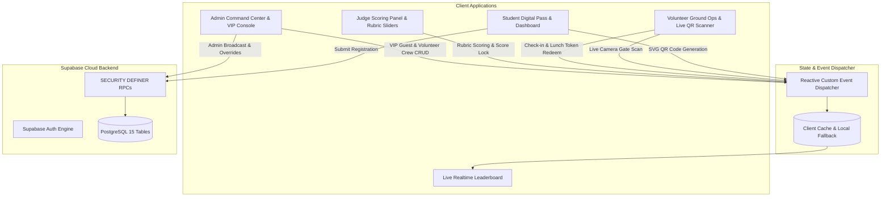

# 🔥 CROSSFIRE 2026 | State-Level Talent Hunt Platform

> **Official Event Platform for Srusti Academy of Graduate Studies (SAGS), Bhubaneswar**  
> State-Level +2 Inter-College Talent Hunt — Quiz, Debate, Poster Making, Treasure Hunt, Ramp Walk, and Reels.

[](https://www.typescriptlang.org/)
[](https://react.dev/)
[](https://vitejs.dev/)
[](https://supabase.com/)
[](https://tailwindcss.com/)
[-success.svg)]()

---

## 📌 1. System Architecture & Overview

CROSSFIRE 2026 is an end-to-end production web application built to coordinate on-campus operations, student intake, live cryptographic QR validation, judge evaluations, dynamic computed leaderboards, VIP guest hospitality, and volunteer crew logistics.



---

## 🏆 2. The 6 Official Competition Tracks

The talent hunt is split into **Group A** and **Group B** (students can participate in up to **2 competitions total**):

| Group | Competition Track | Format | Evaluation Rubric | Prize Pool |
|---|---|---|---|---|
| **A** | **Intellect Odyssey (Quiz)** | Team of 2 | Accuracy (60%), Speed (40%) | ₹13,500 |
| **A** | **Spontaneity Arena (Debate)** | Solo | Argumentation (40%), Clarity (30%), Rebuttal (30%) | ₹13,500 |
| **A** | **Spectrum on Canvas (Poster)** | Solo | Design (35%), Message Clarity (35%), Creativity (30%) | ₹13,500 |
| **B** | **Hidden Horizon (Treasure Hunt)** | Team of 3 | Speed (50%), Accuracy (50%), Bonus (10%) | ₹13,500 |
| **B** | **Glam 'n' Dazzle (Ramp Walk)** | Solo | Appearance (30%), Stage Presence (30%), Personality (40%) | ₹13,500 |
| **B** | **Instaverse (Reels)** | Solo | Creativity (35%), Content (35%), Execution (30%) | ₹13,500 |

---

## 🏛️ 3. Core Role Portals & Wireframes

### 🎓 1. Student Portal (`/#dashboard`)
- **Digital Admit Card & Dynamic SVG QR:** Real-time generation of student QR pass containing student ID, institute, stream, registered events, food preference, and timestamp.
- **Lunch Voucher Modal:** Scannable meal QR code with live redemption status (`Veg` / `Non-veg`).
- **Live Venue Guide:** Real-time room locator, reporting status, and round schedule countdowns.
- **Media Desk:** Instant submission link for Poster and Reels tracks.

### 🤝 2. Volunteer Ground Operations Hub (`/#volunteer`)
- **Live Camera QR Scanner (`html5-qrcode`):** Instant camera-based barcode/QR scanning with camera flipping (front/back), audio confirmation feedback, and image file upload decoder.
- **Fast +2 Verification:** Instant check-in marking and student validation on arrival.
- **Meal Counter Desk:** 1-click Lunch Token redemption to eliminate double-claims.
- **Venue Room Stage Coordinator:** Real-time reporting check to notify judges when candidates are in the room.

### ⚖️ 3. Judge Scoring Panel (`/#judge`)
- **Dynamic Candidate Roster:** Direct link to real registered participants across the 6 tracks with search and filter.
- **Interactive Rubric Sliders:** Real-time weighted criteria scoring according to official track rules.
- **Score Lock Mechanism:** Irreversible lock on submission with audit timestamp.
- **Live Standings:** Instant preview of track rankings as scores are entered.

### 🛡️ 4. Admin Command Center (`/#admin`)
- **Executive KPI Dashboard:** Real-time metrics for total registrations, check-in rate, tokens redeemed, and track completion.
- **VIP Guest Management Console:** Complete hospitality console for Chief Guests, Dignitaries, Judges, and Keynote Speakers (arrival status, vehicle permits, dietary preferences, assigned escorts, and 1-click CSV export).
- **Volunteer Crew Console:** Duty station assignments (Gate, Stage, Help Desk, Refreshments), shift tracking, walkie-talkie channels, and kit distribution logger.
- **WhatsApp Broadcast Desk:** Instant broadcast triggers for debate topics and emergency announcements.
- **Data Export:** 1-click master CSV export for student registrations, guests, and volunteer rosters.

### 📊 5. Live Public Leaderboard (`/#leaderboard`)
- **Dynamic Real-Time Ranking:** Live computed scores from judge evaluations.
- **College Championship Table:** Aggregated points by institution for the overall Rolling Trophy.
- **Search & Filter:** Instant track filtering with podium badges (Gold, Silver, Bronze).

---

## 🔐 4. Security & Database Architecture

- **Supabase Backend:** PostgreSQL 15 database hosted at `https://hvduagntoflynubyaqxs.supabase.co`.
- **Row Level Security (RLS):** Anonymous write restrictions enforced on `users`, `registrations`, `scores`, and `notifications`.
- **SECURITY DEFINER RPCs:** All public intake and queries execute via audited stored procedures:
  - `submit_registration_form`
  - `register_for_event`
  - `get_leaderboard`
  - `admin_overview`
  - `mark_notifications_read`
- **Reactive Dual-Persistence:** High-frequency UI interactions use immediate reactive event dispatchers (`crossfire_registration_updated`, `crossfire_guests_updated`, `crossfire_volunteers_updated`) coupled with persistent background synchronization.

---

## 🛠️ 5. Development & Build Setup

### Prerequisites
- Node.js `v18+` or `v20+` or `v24+`
- npm `v9+` or `v10+`

### Installation
```bash
# Clone repository
git clone https://github.com/sakashdora/CrossFire.git
cd CrossFire

# Install dependencies
npm install
```

### Environment Configuration
Create a `.env` file in the root directory:
```env
VITE_SUPABASE_URL=https://hvduagntoflynubyaqxs.supabase.co
VITE_SUPABASE_ANON_KEY=your-supabase-anon-key
```

### Running Locally
```bash
# Start Vite development server
npm run dev

# Run TypeScript type check
npx tsc --noEmit

# Production Build
npm run build

# Preview Production Build
npm run preview
```

---

## 📁 6. Project Directory Structure

```
c:\CrossFire\
├── dist/                          # Production build output
├── public/                        # Static assets (images, logos, favicon)
├── src/
│   ├── components/                # Reusable UI components
│   │   ├── Header.tsx             # Adaptive fluid glass navigation
│   │   ├── Footer.tsx             # Footer with SAGS branding
│   │   ├── StudentQRCode.tsx      # SVG QR code generator (qrcode.react)
│   │   ├── LiveQRScanner.tsx      # Live camera QR scanner (html5-qrcode)
│   │   ├── NotificationCenter.tsx # System announcement drawer
│   │   └── ...
│   ├── hooks/                     # Custom React hooks
│   │   ├── useAdminData.ts        # Admin analytics, guest & volunteer data
│   │   ├── useLeaderboard.ts      # Real-time computed rankings
│   │   ├── useNotifications.ts    # Broadcast & notification dispatch
│   │   └── ...
│   ├── pages/                     # Main role pages & wireframes
│   │   ├── LandingPage.tsx        # Hero, event showcase, schedule, FAQ
│   │   ├── StudentDashboard.tsx   # Digital Admit Card & Meal QR Pass
│   │   ├── VolunteerDashboard.tsx # Camera gate scanner & meal redemption
│   │   ├── JudgePanel.tsx         # Live candidate roster & rubric sliders
│   │   ├── AdminDashboard.tsx     # VIP Guest, Volunteer Crew & Analytics
│   │   ├── LeaderboardPage.tsx    # Real-time scoreboards
│   │   └── RegistrationPage.tsx   # Google Form intake specification
│   ├── services/                  # Business logic & API services
│   │   ├── studentDataService.ts  # Student data, scores, and storage sync
│   │   ├── guestVolunteerService.ts # VIP Guest & Volunteer Crew CRUD
│   │   └── ...
│   ├── lib/
│   │   └── supabaseClient.ts      # Supabase client & RPC bindings
│   ├── types/
│   │   └── index.ts               # Master TypeScript interfaces
│   ├── App.tsx                    # Main app container & routing
│   └── index.css                  # Tailwind styles & theme variables
├── package.json                   # Project scripts & dependencies
├── tsconfig.json                  # TypeScript configuration
└── vite.config.ts                 # Vite build settings
```

---

## 🤝 7. Organization & Contact

- **Institution:** [Srusti Academy of Graduate Studies](https://srustiacademy.ac.in)
- **Campus:** SAGS Campus, Chandaka Industrial Estate, Patia, Bhubaneswar, Odisha 751024
- **Event Lead:** SAGS Youth & Cultural Committee
- **Tech Lead:** Antigravity Advanced Systems Architecture Team
